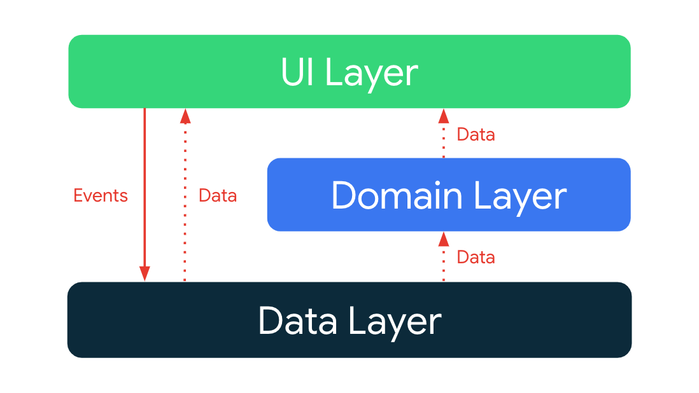
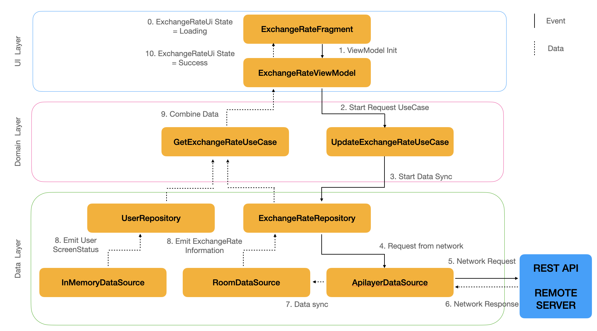
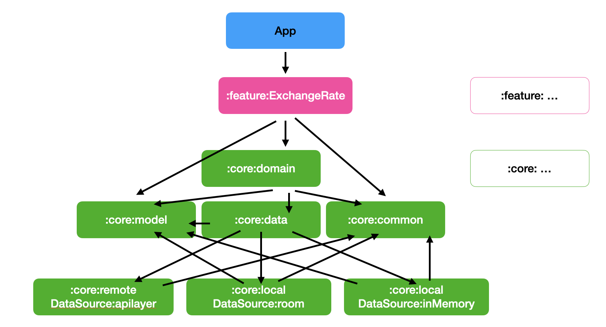

# Architecture

## 목표
앱 아키텍처의 목표는 다음과 같습니다.

*   [official architecture guidance](https://developer.android.com/jetpack/guide) 를 참고해주세요.
*   개발자가 이해하기 쉽고 대중 적인 구조 입니다.
*   동일한 코드베이스에서 작업하는 여러 개발자를 지원합니다.
*   개발자의 컴퓨터와 CI(지속적인 통합)를 사용하여 로컬 및 계측 테스트를 촉진합니다.
*   빌드 시간을 최소화합니다.

## 개요

앱 아키텍처에는 [데이터 계층](https://developer.android.com/jetpack/guide/data-layer) , [도메인 계층](https://developer.android.com/jetpack/guide/domain-layer) 및 [UI 계층](https://developer.android.com/jetpack/guide/ui-layer) 의 세 가지 계층이 있습니다.

[아키텍처는 단방향 데이터 흐름](https://developer.android.com/jetpack/guide/ui-layer#udf) 이 있는 반응형 프로그래밍 모델을 따릅니다 . 맨 아래에 있는 데이터 계층에서 핵심 개념은 다음과 같습니다.

* 상위 계층은 하위 계층의 변화에 반응합니다. 
* 이벤트가 아래로 flow 됩니다. 
* 데이터가 상위로 flow 됩니다.

[데이터 흐름은 Kotlin Flows](https://developer.android.com/kotlin/flow) 를 사용하여 구현된 스트림을 사용합니다.

### Example: ExchangeRate UI 

다음 다이어그램은 발생하는 이벤트와 이를 달성하기 위해 관련 개체에서 데이터가 흐르는 방식을 보여줍니다.

# 모듈화

## 개요

모듈화는 모놀리식, 단일 모듈 코드베이스의 개념을 느슨하게 결합된 자체 포함 모듈로 나누는 방식입니다.

### 모듈화의 이점

**확장성** - 밀접하게 결합된 코드베이스에서 단일 변경으로 인해 일련의 변경이 발생할 수 있습니다. 
적절하게 모듈화된 프로젝트는[관심사 분리 원칙](https://en.wikipedia.org/wiki/Separation_of_concerns) 이 적용됩니다.
이것은 차례로 아키텍처 패턴을 적용하는 동시에 contributors 에게 더 많은 자율성을 부여합니다.

**병렬 작업 활성화** - 모듈화는 버전 제어 충돌을 줄이는 데 도움이 되며 대규모 팀의 개발자가 병렬 작업을 보다 효율적으로 수행할 수 있도록 합니다.

**Ownership** - 모듈에는 코드 및 테스트 유지 관리, 버그 수정 및 변경 사항 검토를 담당하는 전담 소유자가 있을 수 있습니다.

**Encapsulation** - 격리된 코드는 읽기, 이해, 테스트 및 유지 관리가 더 쉽습니다.

**빌드 시간 단축** - Gradle의 병렬 및 증분 빌드를 활용하면 빌드 시간을 줄일 수 있습니다.

**Dynamic delivery** - 모듈화는 앱의 특정 기능을 조건부로 전달하거나 요청 시 다운로드할 수 있도록 하는 [Play Feature Delivery](https://developer.android.com/guide/playcore/feature-delivery) 입니다.

**재사용성** - 적절한 모듈화를 통해 동일한 기반에서 다양한 플랫폼에 걸쳐 코드를 공유하고 여러 앱을 구축할 수 있습니다.

### 모듈화 단점

모듈화는 오용될 수 있는 패턴이며 앱을 모듈화할 때 알아야 할 몇 가지 문제가 있습니다.

**너무 많은 모듈** - 각 모듈에는 빌드 구성의 복잡성이 증가하는 형태로 발생하는 오버헤드가 있습니다. 
이로 인해 Gradle 동기화 시간이 늘어나고 지속적인 유지 관리 비용이 발생할 수 있습니다. 
또한 더 많은 모듈을 추가하면 단일 모놀리식 모듈과 비교할 때 프로젝트의 Gradle 설정이 더 복잡해집니다. 
이는 재사용 가능하고 구성 가능한 빌드 구성을 형식이 안전한 Kotlin 코드로 추출하기 위해 Convention 플러그인을 사용하여 완화할 수 있습니다. 
앱에서 이러한 규칙 플러그인은 [`buildLogic` 폴더] 에서 찾을 수 있습니다 . 

**너무 적은 모듈** - 반대로 모듈이 적고 크며 밀접하게 결합되어 있으면 또 다른 모놀리스가 됩니다. 
이는 모듈화의 일부 이점을 잃게 됨을 의미합니다. 
모듈이 너무 크고 잘 정의된 단일 목적이 없다면 모듈을 분할하는 것을 고려해야 합니다.

**너무 복잡** - 사실 다른 방법은 없습니다. 
프로젝트를 모듈화하는 것이 항상 옳은 것은 아닙니다. 
모듈화를 할때 고려해야할 요인은 코드베이스의 크기와 상대적 복잡성입니다. 
프로젝트가 특정 임계값 이상으로 성장하지 않을 것으로 예상되는 경우 확장성 및 빌드 시간 향상이 적용되지 않습니다.

## 모듈화 전략

모든 프로젝트에 적합한 단일 모듈화 전략은 없습니다. 
그러나 장점을 극대화하고 단점을 최소화하기 위해 따를 수 있는 일반적인 지침이 있습니다.

barebone module은 단순히 내부에 Gradle 빌드 스크립트가 있는 디렉토리입니다. 
그러나 일반적으로 모듈은 하나 이상의 소스 세트와 resource 또는 여러개의 resource로 구성됩니다. 
모듈은 독립적으로 빌드하고 테스트할 수 있습니다. 
Gradle의 유연성으로 인해 프로젝트 구성 방법에 대한 제약이 거의 없습니다. 
일반적으로 낮은 결합도와 높은 응집도를 위해 노력해야 합니다.

* **낮은 결합** - 모듈은 한 모듈에 대한 변경 사항이 다른 모듈에 미치는 영향이 전혀 없거나 최소화되도록 서로 가능한 한 독립적이어야 합니다.
각 모듈들은 다른 모듈의 내부 작동에 대한 내용을 몰라야합니다.

* **높은 응집력** - 모듈은 시스템 역할을 하는 코드 모음으로 구성되어야 합니다. 
명확하게 정의된 책임이 있어야 하며 특정 도메인 지식의 경계 내에 있어야 합니다.

## Wirebarley 모듈 요약

Wirebarley 앱에는 다음 유형의 모듈이 포함되어 있습니다.

* `app` 모듈 - 앱 level navigation 또는 코드베이스를 바인딩 합니다.
`app` 모듈은 모든`feature`모듈을 의존하며 필요한 `core`모듈들을 의존합니다.

* `feature:` 모듈 - 앱에서 단일 책임을 처리하도록 범위가 지정된 특정 feature 모듈입니다.
클래스가 하나의 모듈에서만 필요한 경우 해당 `feature` 모듈 내에 있어야 합니다.
그렇지 않은 경우 적절한 `core` 모듈 로 옮겨야 합니다 .
`feature`모듈은 다른 `feature` 모듈에 대한 종속성이 없어야 합니다. 
필요한 `core`모듈 에만 의존 합니다.

* `core:` 모듈 - 앱의 다른 모듈 간에 공유해야 하는 보조 코드 및 특정 종속성을 포함하는 공통 라이브러리 모듈입니다.
이러한 모듈은 다른 핵심 모듈에 의존할 수 있지만 기능이나 앱 모듈에 의존해서는 안 됩니다.

## 모듈

위의 모듈화 전략을 사용하여 Wirebarley 앱에는 다음과 같은 모듈이 있습니다.

<table>
  <tr>
   <td><strong>Name</strong>
   </td>
   <td><strong>Responsibilities</strong>
   </td>
  </tr>
  <tr>
   <td><code>app</code>
   </td>
   <td>앱이 올바르게 작동하는 데 필요한 모든 것을 통합합니다. 
   </td>
  </tr>
  <tr>
   <td><code>feature:1,</code> 
   <code>feature:2</code> 
   ...
   </td>
   <td>특정 feature 와 관련된 기능입니다. 일반적으로 다른 모듈에서 데이터를 읽는 UI 구성요소 및 ViewModel을 포함합니다.
예를 들면 다음과 같습니다. 
   <ul>
      <li><code>feature:ExchangeRate</code> 환율 정보를 보여줍니다.</li>
    </ul>
   </td>
  </tr>
  <tr>
   <td><code>core:data</code>
   </td>
   <td>여러 기능에서 공유하는 여러 소스에서 앱 데이터를 가져옵니다.
   </td>
  </tr>
  <tr>
   <td><code>core:common</code>
   </td>
   <td>모듈 간에 공유되는 공통 클래스.
   </td>
  </tr>
  <tr>
   <td><code>core:remoteDataSource:apilayer</code>
   </td>
   <td>apilayer API 네트워크 요청을 만들고 원격 데이터 원본에서 응답을 처리합니다.
   </td>
  </tr>
  <tr>
   <td><code>core:testing</code>
   </td>
   <td>종속성, 리포지토리 및 util 클래스 테스트.
   </td>
  </tr>
  <tr>
   <td><code>core:localDataSource:InMemory</code>
   </td>
   <td>메모리를 사용한 Local database storage.
  </tr>
  <tr>
   <td><code>core:localDataSource:room</code>
   </td>
   <td>room을 이용하여 persistent data 제공
  </tr>
  <tr>
   <td><code>core:model</code>
   </td>
   <td>앱 전체에서 사용되는 모델 클래스입니다.
  </tr>
</table>